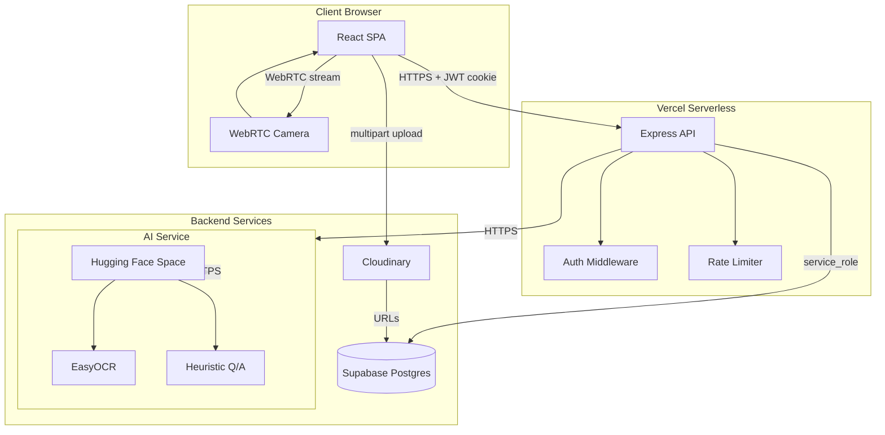
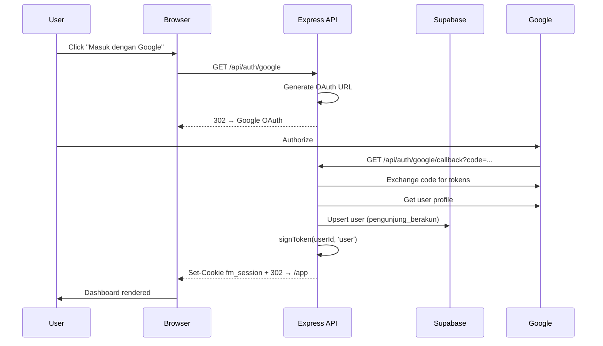
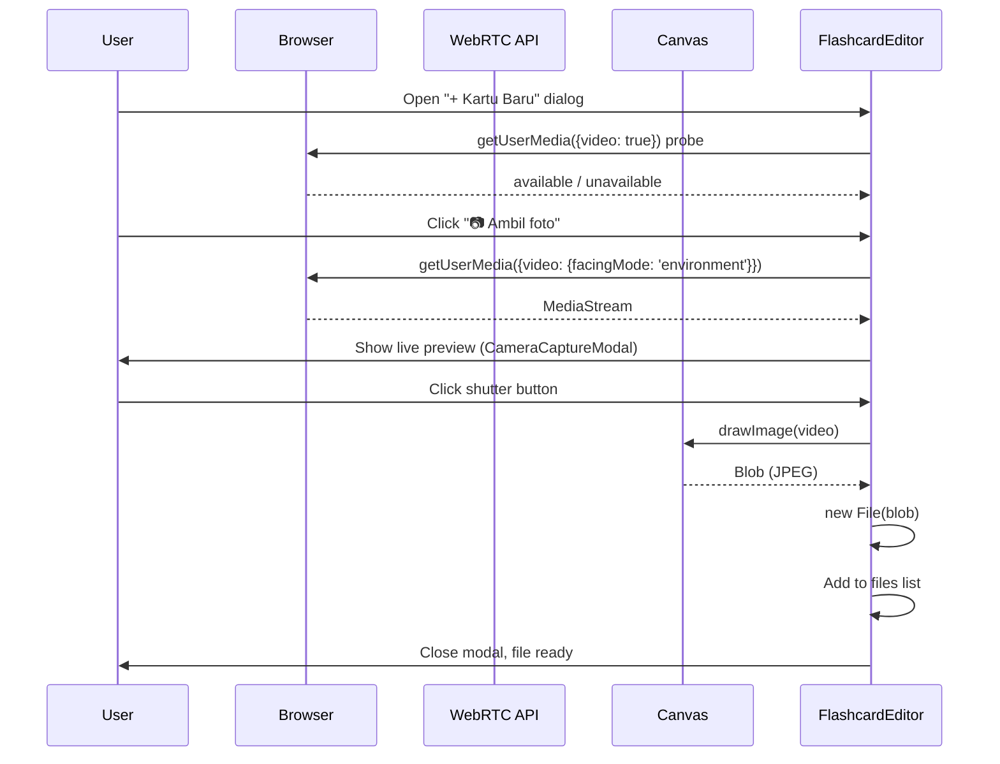
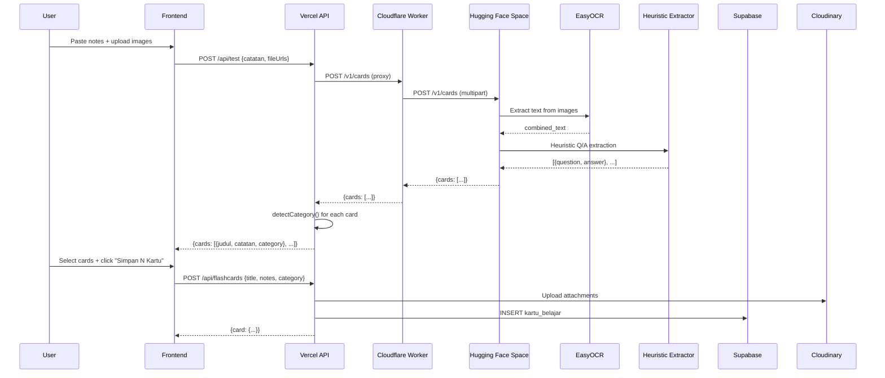
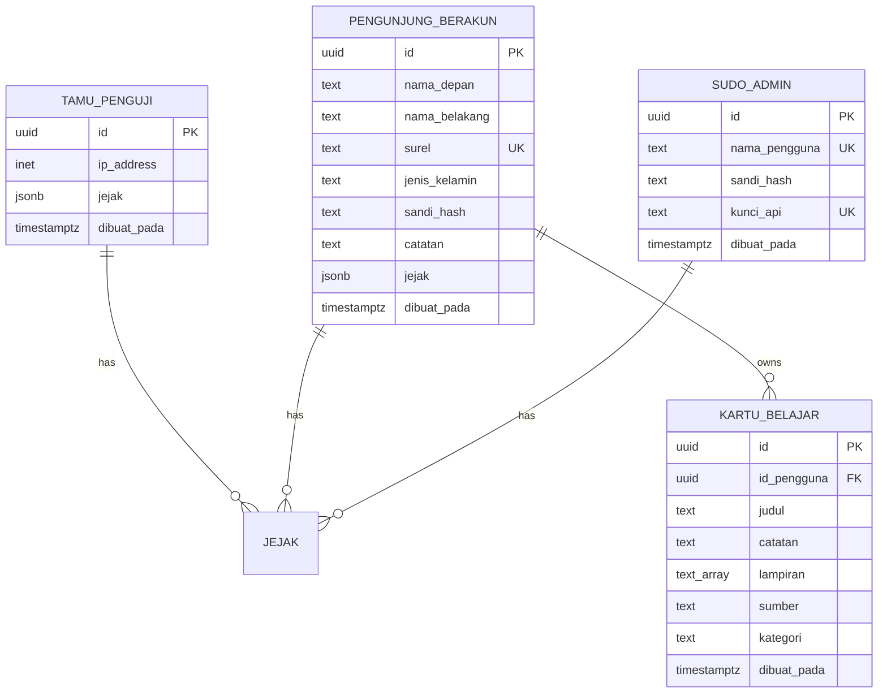

# FlashMind

> AI-powered flashcard learning platform for Indonesian students.
> Convert your notes (text or handwritten photos) into structured Q/A flashcards automatically.

[]()
[]()
[]()
[]()

---

## 📋 Table of Contents

- [Overview](#overview)
- [Tech Stack](#tech-stack)
- [Architecture](#architecture)
- [Features](#features)
- [Quick Start](#quick-start)
- [Project Structure](#project-structure)
- [Development](#development)
- [Build Variants](#build-variants)
- [Deployment](#deployment)
- [Documentation](#documentation)
- [Testing](#testing)
- [API Reference](#api-reference)
- [License](#license)

---

## Overview

**FlashMind** is a full-stack web application that helps Indonesian students create study flashcards from their notes using AI. Take a photo of your handwritten notes or paste text — the app extracts key concepts, formats them as question/answer pairs, and groups them by subject (Biologi, Fisika, Matematika, etc.).

**Why FlashMind?**

- 📸 **Camera-first**: Built-in WebRTC camera capture (iOS Camera-style), no file picker
- 🤖 **AI-powered**: Hugging Face Spaces (EasyOCR + heuristic Q/A extraction)
- 🇮🇩 **Indonesian-first**: Native support for bahasa Indonesia with category detection
- 🏷️ **Auto-categorization**: 10 subject categories (Biologi, Fisika, Kimia, etc.) detected automatically
- ☁️ **Cloud-hosted**: Supabase Postgres + Cloudinary + Vercel serverless

---

## Tech Stack

| Layer | Technology |
|-------|------------|
| **Frontend** | Vite 5 + React 18 + TypeScript 5.6 |
| **Styling** | CSS3 with custom properties, responsive (mobile → TV 4K) |
| **State** | React Context (Auth) + local state |
| **Routing** | React Router 6 |
| **Forms** | Native + custom validation (Unicode-safe character limits) |
| **Camera** | WebRTC `getUserMedia` (with `facingMode: 'environment'`) |
| **Backend** | Express.js 4 + TypeScript |
| **Database** | Supabase Postgres 15 (with RLS via service_role key) |
| **Auth** | JWT cookies (`httpOnly`, `SameSite=lax`, 7-day expiry) + bcrypt |
| **OAuth** | Google OAuth 2.0 |
| **File Upload** | Multer (multipart) |
| **Image Storage** | Cloudinary (URLs in DB, no base64) |
| **AI/OCR** | Hugging Face Spaces (EasyOCR + heuristic Q/A) |
| **Proxy** | Cloudflare Worker (bypass Vercel egress block to HF) |
| **Testing** | Vitest 2 + Testing Library + jsdom |
| **E2E Testing** | Chrome DevTools Protocol via `chrome-remote-interface` |
| **Deployment** | Vercel (serverless functions) |

---

## Architecture

### System Overview



### Authentication Flow



### Camera Capture Flow (Mobile)



### AI Generation Flow



### Database Schema



---

## Features

### 🎓 AI Flashcard Generation

- **Text input**: Paste notes → AI extracts Q/A pairs
- **Image input**: Upload/photograph handwritten notes → OCR → Q/A extraction
- **Auto-categorization**: 10 subject categories (Biologi, Fisika, Kimia, Matematika, Bahasa Inggris, Bahasa Indonesia, Sejarah, Geografi, Ekonomi, Pemrograman)
- **Character limits**: 120 (front) / 500 (back) with Unicode-safe counting

### 📷 iOS Camera-Style Capture

- **Auto-detect** camera on dialog open (no manual permission dance)
- **Live preview** in full-size modal (works on mobile + desktop)
- **iOS Camera-style shutter button** (CSS-only icon, no text/emoji)
- **Portrait**: shutter at bottom-center, above mobile nav bar
- **Landscape**: shutter at right side, doesn't obscure video
- **No file picker** — direct WebRTC capture → canvas → JPEG file

### 🏷️ Category Management

- **Auto-detect** category from text (Indonesian/English)
- **Sidebar navigation** with color-coded category dots
- **Grouped sections** by category in main dashboard
- **Filter chips** to focus on specific category

### 🔐 Authentication

- **Email/password** with bcrypt hashing (cost 12)
- **Google OAuth 2.0** (full flow)
- **Guest mode** (1 row per IP per 60s, deduped)
- **JWT cookie sessions** (`httpOnly`, `SameSite=lax`, 7-day expiry)
- **Role-based** (user / guest / admin via `sudo_admin` table)

### 📱 Responsive Design

- **Mobile** (≤480px): full-screen camera modal, single-column dashboard
- **Tablet** (481-1024px): 2-column dashboard grid
- **Desktop** (1025-1920px): 3-column grid
- **TV 4K** (≥1920px): 4-column grid + optimized layouts

---

## Quick Start

### Prerequisites

- Node.js 20.x or 22.x
- npm 10.x
- Supabase account (Postgres + RLS)
- Cloudinary account (free tier OK)
- Hugging Face account (for AI Space, optional — fallback heuristic)
- Cloudflare account (for Worker proxy, optional)
- Google Cloud project (for OAuth, optional)

### Installation

```bash
git clone https://github.com/0xnullsys/flashmind-api.git
cd flashmind-api
npm install
cp .env.example .env
# Edit .env with your credentials
npm run dev
```

Visit `http://localhost:5173` (frontend) and `http://localhost:3001/api/health` (backend).

### Environment Variables

| Variable | Required | Description |
|----------|----------|-------------|
| `SUPABASE_URL` | ✅ | Your Supabase project URL |
| `SUPABASE_ANON_KEY` | ✅ | Anon key (for browser-side) |
| `SUPABASE_SERVICE_ROLE_KEY` | ✅ | Service role (for backend, bypasses RLS) |
| `SESSION_SECRET` | ✅ | 32+ char random string for JWT signing |
| `CLOUDINARY_CLOUD_NAME` | ✅ | Cloudinary cloud name |
| `CLOUDINARY_API_KEY` | ✅ | Cloudinary API key |
| `CLOUDINARY_API_SECRET` | ✅ | Cloudinary API secret |
| `CF_PROXY_URL` | ✅ | Cloudflare Worker URL (or HF Space URL) |
| `HF_SPACE_ID` | ❌ | Hugging Face Space ID (legacy) |
| `GOOGLE_CLIENT_ID` | ❌ | Google OAuth client ID |
| `GOOGLE_CLIENT_SECRET` | ❌ | Google OAuth client secret |
| `GOOGLE_CALLBACK_URL` | ❌ | OAuth callback URL (default: localhost) |

---

## Project Structure

```
flashmind/
├── src/                          # Frontend (Vite + React)
│   ├── components/               # Reusable UI components
│   │   ├── CameraCaptureModal.tsx  # iOS Camera-style modal
│   │   ├── Flashcard.tsx          # Single card with flip animation
│   │   ├── FlashcardEditor.tsx     # AI-integrated card creation
│   │   ├── EditCardModal.tsx       # Edit existing card
│   │   ├── DevBanner.tsx           # Dev mode banner (visible only in dev builds)
│   │   └── AuthDialog.tsx          # Login/register modal
│   ├── pages/                     # Route components
│   │   ├── Landing.tsx             # Public marketing page (scrollify)
│   │   └── Dashboard.tsx           # Authenticated cards dashboard
│   ├── lib/                       # Shared utilities
│   │   ├── api.ts                  # API client (auto-fetch with cookies)
│   │   ├── auth.tsx                # React Context for auth state
│   │   └── charLimits.ts           # Unicode-safe character counting
│   ├── styles.css                 # Global styles (with mobile + landscape queries)
│   ├── config.ts                  # Build config (mode-aware)
│   ├── App.tsx                    # Root component with router
│   └── main.tsx                   # Entry point
│
├── server/                       # Backend (Express)
│   ├── routes/                    # API route handlers
│   │   ├── auth.ts                 # /api/auth/* (login, register, google, guest)
│   │   ├── flashcards.ts           # /api/flashcards/* (CRUD + PATCH)
│   │   ├── users.ts                # /api/users/* (profile)
│   │   ├── test.ts                 # /api/test (AI generation)
│   │   ├── uploads.ts              # /api/uploads (Cloudinary)
│   │   └── v0.ts                   # /api/v0/* (admin)
│   ├── auth.ts                    # JWT + bcrypt middleware
│   ├── ai.ts                      # HF Space integration (with CF Worker proxy)
│   ├── supabase.ts                # Supabase client (service_role)
│   ├── rateLimit.ts               # Token bucket rate limiter
│   ├── app.ts                      # Express app setup
│   ├── dev.ts                     # Dev server (port 3001)
│   └── index.ts                    # Vercel function entry
│
├── cloudflare-worker/            # CF Worker proxy for HF Space
│   ├── src/index.ts                # Proxy /v1/cards → HF Space
│   └── wrangler.toml               # CF Worker config
│
├── scripts/                       # Utility scripts
│   ├── test-*-cdp.mjs              # E2E tests via Chrome DevTools Protocol
│   ├── debug-*.mjs                 # Debug helpers
│   ├── gen-seed.mjs                # Generate seed data
│   └── populate.mjs                # Populate database
│
├── hf-space-source/              # Local mirror of HF Space source
│   └── app.py                      # OCR + heuristic logic
│
├── docs/                          # Generated documentation
│   └── api/                        # TypeDoc-generated API reference
│
├── schema.sql                     # Complete database schema (idempotent)
├── typedoc.json                   # TypeDoc config
├── vite.config.ts                 # Vite build config (dev/prod variants)
├── vercel.json                    # Vercel deployment config
├── tsconfig.json                  # Frontend TypeScript config
├── tsconfig.server.json           # Backend TypeScript config
├── vitest.config.ts               # Vitest + jsdom test config
├── BRANCHING.md                   # Git branching + deploy strategy
├── SPEC.md                        # Product spec (Indonesian)
└── package.json                   # Dependencies + scripts
```

---

## Development

### Scripts

| Script | Description |
|--------|-------------|
| `npm run dev` | Start Vite (`:5173`) + backend (`:3001`) concurrently |
| `npm run build:dev` | Build dev bundle (dev banner, source maps, debug) |
| `npm run build:prod` | Build prod bundle (minified, no source maps) |
| `npm test` | Run unit tests (47 tests, Vitest + jsdom) |
| `npm run docs` | Generate API docs (TypeDoc → `docs/api/`) |
| `npm run docs:watch` | Watch mode for TypeDoc |
| `npm run docs:serve` | Serve docs locally on `:8080` |

### Test Commands

```bash
# Run all tests
npm test

# Run specific test file
npx vitest run src/lib/charLimits.test.ts

# Watch mode
npx vitest

# CDP tests (require Chrome with --remote-debugging-port=9222)
node scripts/test-camera-preview-cdp.mjs
node scripts/test-merged-dialog-cdp.mjs
node scripts/test-edit-card-cdp.mjs
```

### Code Style

- **TypeScript strict mode** (`strict: true`)
- **Ponytail comments**: `// ponytail: <reason>` for non-obvious decisions
- **No `any`**: Use specific types or `unknown`
- **Unicode-safe**: Use `Array.from(str).length` for character counts
- **Idempotent migrations**: `CREATE TABLE IF NOT EXISTS`, etc.

---

## Build Variants

| Variant | Command | Output | Dev banner | Source maps |
|---------|---------|--------|------------|-------------|
| **Production** | `npm run build:prod` | `dist/assets/index-*.js` (~200 KB) | ❌ Hidden | ❌ No |
| **Development** | `npm run build:dev` | `dist/assets/index-*.js` (~201 KB) | ✅ Visible | ✅ Yes (825 KB) |

### Environment Variables per Build

| Variable | Production | Development |
|----------|------------|-------------|
| `VITE_APP_MODE` | `production` (default) | `development` |
| `VITE_APP_NAME` | `"FlashMind"` | `"FlashMind (Dev)"` |
| `VITE_ENABLE_DEBUG` | `false` | `true` |
| `VITE_ENABLE_ANALYTICS` | `true` | `false` |
| `VITE_BUILD_ID` | `"prod-stable"` | `"dev-preview"` |

---

## Deployment

### Branch Strategy

| Branch | Vercel Environment | URL Pattern |
|--------|-------------------|-------------|
| `main` | Production | `https://flashmind-api.vercel.app` |
| `dev` | Preview (auth-protected) | `https://flashmind-api-git-dev-<team>.vercel.app` |
| `feat/*` | Preview (ephemeral) | `https://flashmind-git-<branch>-<team>.vercel.app` |

See [BRANCHING.md](BRANCHING.md) for full strategy.

### Deploy to Production

```bash
git checkout main
git merge dev --no-ff
git push origin main
# Vercel auto-deploys
```

### Database Migration

Run `schema.sql` in Supabase SQL Editor (idempotent, safe to re-run):

```sql
-- Paste schema.sql contents into Supabase SQL Editor
-- Run query
```

---

## Documentation

| Resource | Location |
|----------|----------|
| **API Reference** | [docs/api/index.html](docs/api/index.html) (TypeDoc-generated) |
| **Branching Strategy** | [BRANCHING.md](BRANCHING.md) |
| **Product Spec** | [SPEC.md](SPEC.md) (Indonesian) |
| **Agent Context** | [.pi-memctx.json](.pi-memctx.json) (for Pi Agent) |
| **Database Schema** | [schema.sql](schema.sql) |

### Generate Docs

```bash
npm run docs
# Open docs/api/index.html in browser
```

---

## Testing

### Test Coverage

```
Test Files: 5 passed
Tests:       47 passed
Duration:   ~5s
```

| Suite | Tests | Coverage |
|-------|-------|----------|
| `server/ai.test.ts` | 11 | `detectCategory()` heuristic (Biologi, Fisika, etc.) |
| `src/lib/charLimits.test.ts` | 16 | Unicode-safe counting (emoji, CJK, diacritics) |
| `src/components/Flashcard.test.tsx` | 6 | Flashcard component + wordwrap CSS |
| `src/components/FlashcardEditor.test.tsx` | 9 | AI-integrated editor flow |
| `src/components/FlashcardEditor.camera.test.tsx` | 6 | Camera modal flow |

### E2E Tests (CDP)

| Script | What it verifies |
|--------|------------------|
| `scripts/test-camera-preview-cdp.mjs` | iOS Camera-style modal in portrait + landscape |
| `scripts/test-edit-card-cdp.mjs` | Edit flow + responsive char fit |
| `scripts/test-merged-dialog-cdp.mjs` | Merged "+ Kartu Baru" dialog |
| `scripts/test-landing-cdp.mjs` | Landing page + scrollify |
| `scripts/test-wordwrap-cdp.mjs` | Card text wrapping |
| `scripts/test-char-limit-accurate.mjs` | Margin-aware char limit math |
| `scripts/test-dev-build-cdp.mjs` | Dev banner visibility |

Run CDP tests with Chrome debug port:

```bash
# Start Chrome with remote debugging
chrome.exe --remote-debugging-port=9222

# In another terminal:
node scripts/test-camera-preview-cdp.mjs
```

---

## API Reference

See [docs/api/index.html](docs/api/index.html) for full TypeDoc-generated API reference.

### Key Endpoints

| Method | Path | Auth | Description |
|--------|------|------|-------------|
| `POST` | `/api/auth/register` | ❌ | Register new user (email/password) |
| `POST` | `/api/auth/login` | ❌ | Login (returns JWT cookie) |
| `POST` | `/api/auth/logout` | ✅ | Clear session cookie |
| `POST` | `/api/auth/guest` | ❌ | Create guest session (rate-limited) |
| `GET`  | `/api/auth/google` | ❌ | Initiate Google OAuth flow |
| `GET`  | `/api/auth/google/callback` | ❌ | OAuth callback |
| `GET`  | `/api/auth/status` | ❌ | Current role (user/guest/null) |
| `GET`  | `/api/flashcards` | ✅ | List user's cards |
| `POST` | `/api/flashcards` | ✅ | Create card (with char limit validation) |
| `PATCH` | `/api/flashcards/:id` | ✅ | Edit card |
| `DELETE` | `/api/flashcards/:id` | ✅ | Delete card |
| `POST` | `/api/test` | ❌ | AI flashcard generation (preview) |
| `POST` | `/api/uploads` | ✅ | Upload image to Cloudinary |
| `GET`  | `/api/users` | ✅ | Current user profile |
| `PATCH` | `/api/users` | ✅ | Update profile |
| `GET`  | `/api/v0/flashcards` | 🔑 | Admin: list all cards |
| `GET`  | `/api/v0/users` | 🔑 | Admin: list all users |
| `GET`  | `/api/v0/stats` | 🔑 | Admin: dashboard stats |

Legend: ✅ user required · 🔑 admin API key required · ❌ public

---

## License

MIT © 2026 FlashMind Contributors

---

**Built with ❤️ for Indonesian students**
